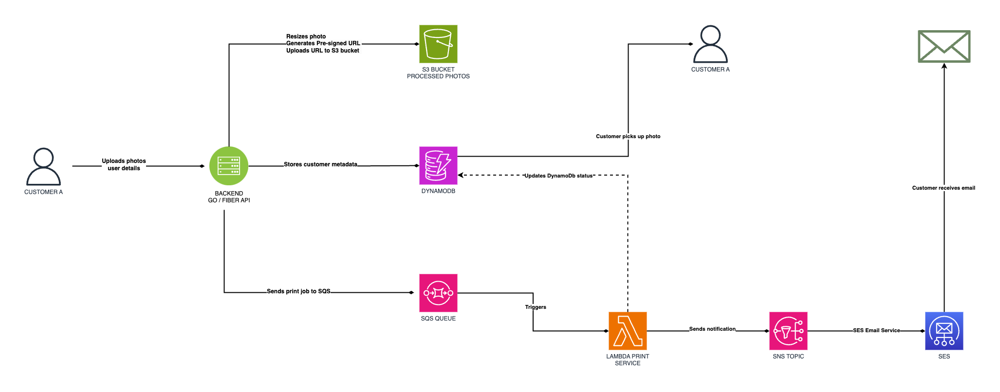

# SnapFlow - Senior-Level Documentation

## 1. Overview
**Project Name:** SnapFlow (Sprint Print)
**Description:** A cloud-based photo printing workflow that allows users to upload, process, and print photos, with automated tracking and customer notifications.  
**Target Audience:** Developers, DevOps engineers, and cloud architects.  
**Key Technologies:** Go (Fiber), AWS (S3, DynamoDB, SQS, Lambda, SNS, SES), Terraform.  

## 1.1. About Company X:
There are four major divisons in Company X.

1.  Admin - Order and Payment: Payment processing is handled by the admin office. When a customer / photographer walks, they place an order with their details, confirm the format for their photos (this include paper type and size, which are important). Once this is done, they are issued a receipt. This receipt is to the editing department alongside the photos (which is either scanned or uploaded to the computer's hard drive). In short, order and payment are confirmed first before anything else is done.

2.  Editing: The next phase (where I worked), handles all editing (this can range from cropping / resizing to color correction and sharpness, etc.). Photos cannot be editied without the order/payment receipt. Once an editor / retoucher receives a receipt, photos are scanned or uploaded, then a folder structure is created for that customer, time stamped with a date. This format helps us keep record of what was edited and when in case there's an error we can always roll back. Now, once the order is taken and photos uploaded, editing of the photo starts, once done, it is sent for printing. Since my department specializes on `Sprint print`--sprint print is an express-on-budget form of editing plus printing that we mostly run. This means we prioritize only two forms of editing from a bucket of options--which are color correction and resize. Edited photos are marked as sprint print before its sent to the printing department.
    
3.  Printing: once the editing department sends the edited photos for printing, a sprint print is initiated (this is based on whether the sent photos are marked as sprint print). For sprint print, notifications are not sent to the customer, this is the key difference. They wait to collect their photos which often takes a minutes. Sprint print is mostly for less than 5 photos. Less payment and overhead, hence the name.
   
4.  Delivery | collection: the delivery department handles all delivery of photos (whether framed or not). Sprint print photos are collected here once printing is complete.

## 1.1. Purpose of the project: 
I wanted to simulate the process of the sprint print in the editing department, which is fast paced using Amazon Web Services. S3 for blob storage and DynamoDB for using details / metadata. While a Lambda function simulates the printing process (this Lambda function can also be attached to a printer). The Lambda function then proceeds to update the DynamoDB table with a "printed" notice once the printing is complete. This print request comes from an SQS queue that decouples the workflow in case there are multiple requests coming in at the same time. Print jobs are then pulled off one stack at a time. An order is received with details, which are then stored in our database (in this case, the hard drive). Afterwards, I edit and send for printing. Editors in the sprint print department do not concern themselves with notifiying customers, our job is pretty much simple but very fast. 

## 2. System Architecture
### 2.1 Workflow Diagram
<!--  -->

### **2.2 Features and Workflow**
   - **User Upload Process**:
     - How the Go backend processes photo uploads.
     - Pre-signed URL generation for secure S3 uploads.
   - **Storage and Data Handling**:
     - How S3 and DynamoDB store processed data.
   - **Print Job Handling**:
     - How SQS queues and Lambda simulate printing.
   - **DynamoDB Status Updates**:
     - Transition states: `uploaded → processing → printed`
   - **Notifications SNS/SES**:
     - Explain how they are used.

### 2.3 Component Breakdown
1. **User Uploads:**
   - Basic HTML form for photo and user input. 
2. **Go/Fiber Backend:**
   - Processes photo, generates a signed URL, uploads to S3, updates DynamoDB, and sends print request to SQS.
3. **AWS Services:**
   - **S3:** Stores resized photos.
   - **DynamoDB:** Tracks customer data and photo status.
   - **SQS:** Holds print job requests.
   - **Lambda:** Processes print jobs, updates status, sends notifications.
   - **SNS & SES:** Sends customer email notifications. (SES has not been included)

## 3. Installation & Setup
### 3.1 Prerequisites
- [Go](https://go.dev/doc/install) installed
- [Air](https://github.com/air-verse/air) installed
- [AWS CLI](https://docs.aws.amazon.com/cli/latest/userguide/getting-started-install.html) configured
- [Terraform](https://developer.hashicorp.com/terraform/) installed
- Required AWS permissions

### 3.2 Setting Up the Environment
- Clone repository
- Configure `.env` file with:
  - `AWS_ACCESS_KEY_ID`
  - `AWS_SECRET_ACCESS_KEY`
  - `S3_BUCKET_NAME`
  - `DYNAMODB_TABLE_NAME`
  - `SQS_QUEUE_URL`
  - `SNS_TOPIC_ARN`

### 3.3 Deploying AWS Infrastructure
  - **Step-by-Step Setup**:
     - Cloning the repository
        - `git clone git@github.com:30Piraten/snapflow.git`
     - Setting up the `.env` file
        - Use the predifined .env variables above
     - Running the Go backend
        - for the backend, you can have air installed and run `air`(see repo: ) from the src/ dir
          or you can run `go run main.go || go run .` from the src/ dir
     - Deploying infrastructure using Terraform
        - to deploy the defined AWS services config with terraform
        run  the following command: 
            - `terraform init && terraform validate` 
            - `terraform plan && terraform apply`

## 4. Backend API
### 4.1 Endpoints
| Method | Endpoint | Description |
|--------|---------|-------------|
| POST | `/upload` | Uploads photo and customer info |
| GET | `/status/:photo_id` | Retrieves print status |

### 4.2 Key Functions -> tell us what the key functions do 
- `ResizePhoto()`
- `GeneratePresignedURL()`
- `UploadToS3()`
- `UpdateDynamoDB()`
- `SendToSQS()`

### 5. Error Handling -> add to future enhancements 
- Retry logic for SQS failures
- DynamoDB update rollback

## 6. Testing & Debugging
### 6.1 Unit Tests
- Test `ResizePhoto()` function
- Test `GeneratePresignedURL()`

### 6.2 Integration Tests
- Simulate photo upload
- Manually check S3 and DynamoDB entries

### 6.3 AWS-Specific Debugging
- Checking SQS logs
- Debugging Lambda via CloudWatch

## 7. Deployment & CI/CD -> tied to next project
- Use GitHub Actions for automated deployment.
- Run Terraform in CI/CD for AWS infrastructure updates.

## 8. Future Enhancements
- Implement real printing service.
- Add customer dashboard for tracking.

## 9. Conclusion
- Recap of features and workflow.
- How to contribute to the project.
:: This is recap of my 

