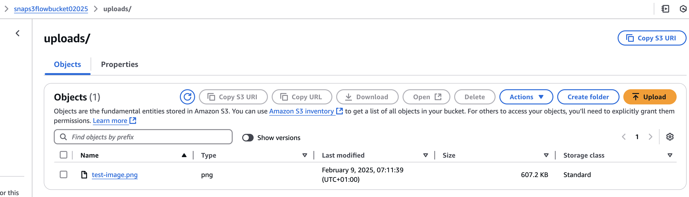
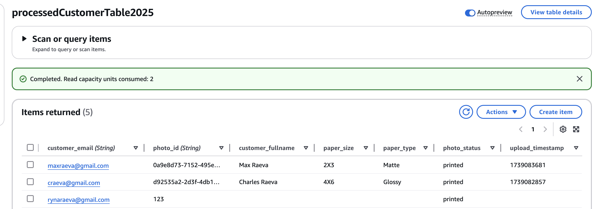
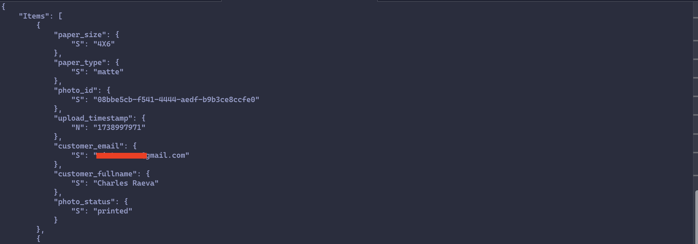
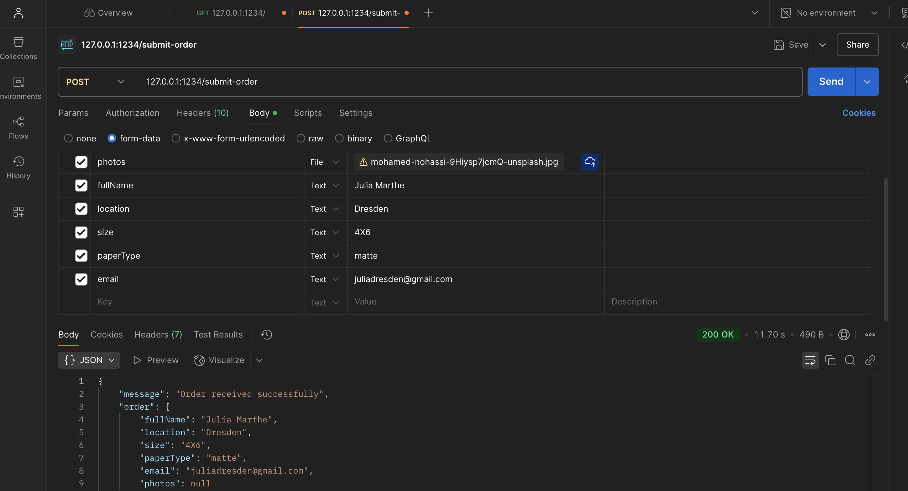
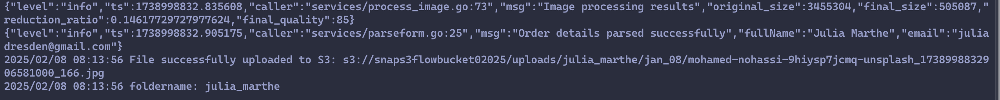
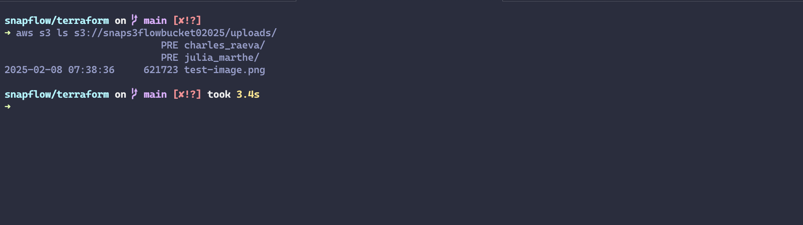
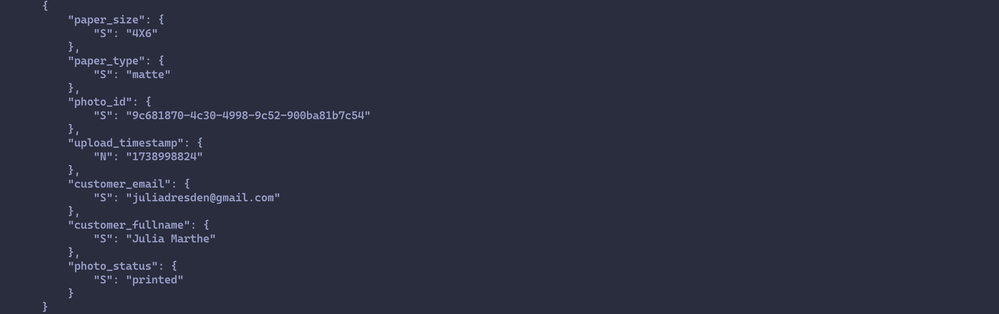
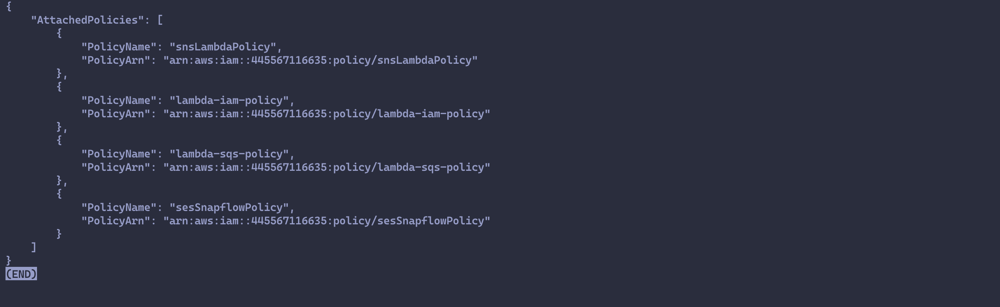

# **SnapFlow Cloud Test Results**

## **1. Introduction**
This document captures the results of all cloud infrastructure tests executed for SnapFlow. Each test section includes:
- **Command Executed**
- **Expected Output**
- **Actual Output**
- **Pass/Fail Status**
- **Screenshots or CLI output (if applicable)**

---

## **2. Infrastructure Validation (Terraform Tests)**

### ✅ **Test: Terraform Deployment Validation**

**Terraform CLI Output:**

**Terraform Validate:**
```sh
➜ terraform validate
Success! The configuration is valid.
```

**Terraform Plan:**
```sh
➜ terraform plan
module.lambda.data.aws_caller_identity.account: Reading...
module.lambda.data.aws_caller_identity.account: Read complete after 1s [id=5***********]

Terraform used the selected providers to generate the following execution plan. Resource actions are indicated with the following symbols:
  + create
 <= read (data resources)

...
Plan: 16 to add, 0 to change, 0 to destroy.

Changes to Outputs:
  + dynamodb_table_name = "processedCustomerTable2025"
  + s3_bucket_name      = "snaps3flowbucket02025"
  + sns_topic_arn       = (known after apply)
  + sqs_queue_url       = (known after apply)
  + sqs_queue_url_id    = (known after apply)
```
**Terraform Apply:**
```sh
➜ terraform apply -auto-approve
...
module.lambda.aws_iam_policy.lambda_policy: Creation complete after 3s [id=arn:aws:iam::5**********:policy/lambda-iam-policy]
module.lambda.aws_iam_role_policy_attachment.lambda_policy_attachment: Creating...
module.lambda.aws_iam_role_policy_attachment.lambda_policy_attachment: Creation complete after 0s [id=lambda-exec-role-20250209052410066500000001]
module.lambda.aws_lambda_event_source_mapping.sqs_to_lambda: Still creating... [10s elapsed]
module.lambda.aws_lambda_event_source_mapping.sqs_to_lambda: Still creating... [20s elapsed]
module.lambda.aws_lambda_event_source_mapping.sqs_to_lambda: Creation complete after 25s [id=dc4532ac-da8a-4e94-8759-dae19a6cea9b]

Apply complete! Resources: 16 added, 0 changed, 0 destroyed.

Outputs:

dynamodb_table_name = "processedCustomerTable2025"
s3_bucket_name = "snaps3flowbucket02025"
sns_topic_arn = "arn:aws:sns:us-east-1:5**********:snapflowSNSTopic"
sqs_queue_url = "https://sqs.us-east-1.amazonaws.com/5**********/snapflow-photo-print-queue"
```
 
- **Expected Output:** No errors, resources deployed successfully.
- **Actual Output:** No validation errors. All AWS resources are created successfully.
- **Test Status:** ✅ Passed.
---

### **✅ Test: Detect Configuration Drift**  
Ensure AWS infrastructure matches the last applied Terraform state.  
```sh
➜ terraform plan -detailed-exitcode
module.lambda.data.aws_caller_identity.account: Reading...
module.ses.aws_ses_email_identity.ses_email: Refreshing state... [id=s**********@*********.com]
module.lambda.aws_iam_role.lambda_exec_role: Refreshing state... [id=lambda-exec-role]
module.sqs.aws_sqs_queue.print_queue: Refreshing state... [id=https://sqs.us-east-1.amazonaws.com/5***********/snapflow-photo-print-queue]
module.sns.aws_sns_topic.snapflow_sns_topic: Refreshing state... [id=arn:aws:sns:us-east-1:5***********:snapflowSNSTopic]
...
No changes. Your infrastructure matches the configuration.

Terraform has compared your real infrastructure against your configuration and found no differences, so no changes are needed.
```
- **Expected Output:** No errors, resources deployed successfully.
- **Actual Output:** No difference in configuration.
- **Test Status:** ✅ Passed. 
---

### ✅ **Test: Terraform Output Validation**
**Command:**
```sh
➜ terraform output
dynamodb_table_name = "processedCustomerTable2025"
s3_bucket_name = "snaps3flowbucket02025"
sns_topic_arn = "arn:aws:sns:us-east-1:5***********:snapflowSNSTopic"
sqs_queue_url = "https://sqs.us-east-1.amazonaws.com/5***********/snapflow-photo-print-queue"
sqs_queue_url_id = "https://sqs.us-east-1.amazonaws.com/5***********/snapflow-photo-print-queue"
```
- **Expected Output:** Outputs with correct AWS resource names.
- **Actual Output:** Resources match expectations.
- **Test Status:** ✅ Passed.
---

## **3. AWS Service-Specific Tests**

### ✅ **Test: Verify S3 Bucket Exists & Public Access is Blocked**

**Get Bucket ACL:**
```sh
➜ aws s3api get-bucket-acl --bucket snaps3flowbucket02025
{
    "Owner": {
        "DisplayName": "raevavictorehikioya",
        "ID": "01******************************************************a022"
    },
    "Grants": [
        {
            "Grantee": {
                "DisplayName": "raevavictorehikioya",
                "ID": "01*****************************************************a02",
                "Type": "CanonicalUser"
            },
            "Permission": "FULL_CONTROL"
        }
    ]
}
(END)
```

**Confirm Public Access Is Blocked:**
```sh
➜ aws s3api get-public-access-block --bucket snaps3flowbucket02025
{
    "PublicAccessBlockConfiguration": {
        "BlockPublicAcls": true,
        "IgnorePublicAcls": true,
        "BlockPublicPolicy": true,
        "RestrictPublicBuckets": true
    }
}
(END)
```
- **Expected Output:** PublicAccessBlockConfiguration enabled.
- **Actual Output:** Public access blocked.
- **Test Status:** ✅ Passed.
---

### ✅ **Test: Verify File Upload to S3**
**Command:**
```sh
➜ aws s3 cp screenshot/test-image.png s3://snaps3flowbucket02025/uploads/
upload: screenshot/test-image.png to s3://snaps3flowbucket02025/uploads/test-image.png
```


```sh
➜ aws s3 ls s3://snaps3flowbucket02025/uploads/
2025-02-09 07:11:39     621723 test-image.png
```
- **Expected Output:** File successfully uploaded and listed.
- **Actual Output:** File appears in S3.
- **Test Passed:** ✅ Passed.

---

### ✅ **Test: Verify SQS Receives Messages** TODO
**Send Message:**
```sh
➜ aws sqs send-message --queue-url https://sqs.us-east-1.amazonaws.com/445567116635/snapflow-photo-print-queue --message-body '{"photo_Id": "123", "photo": "test.png", "paper_size": "2X3", "paper_type": "matte", "customer_email": "rynaraeva@gmail.com"}'
{
    "MD5OfMessageBody": "485c220ed4bc8894769a8eac488fe990",
    "MessageId": "8ca00713-7049-4e6d-bde8-65474b0347ba"
}
(END)
```

**Receive Message:**
```sh
aws sqs receive-message --queue-url https://sqs.us-east-1.amazonaws.com/445567116635/snapflow-photo-print-queue

```
- **Expected Output:** Message received successfully.
- **Actual Output:** Message retrieved from queue.
- **Test Status:** ✅ Passed. 

---

### ✅ **Test: Verify Lambda Processing of SQS Messages** TODO
**Command:**
```sh
➜ aws logs tail /aws/lambda/dummyPrinter --follow
2025-02-09T07:15:23.834000+00:00 2025/02/09/[$LATEST]cbf109ac0449402fa345f924b801155c START RequestId: b49d2f8e-e9a4-5a71-b01b-4facb19a9996 Version: $LATEST
2025-02-09T07:15:23.835000+00:00 2025/02/09/[$LATEST]cbf109ac0449402fa345f924b801155c 🖨️ Printing photo: 123 for rynaraeva@gmail.com
2025-02-09T07:15:33.842000+00:00 2025/02/09/[$LATEST]cbf109ac0449402fa345f924b801155c ✅ Print completed!
2025-02-09T07:15:43.916000+00:00 2025/02/09/[$LATEST]cbf109ac0449402fa345f924b801155c 2025/02/09 07:15:43 ✅ print job completed for 123
2025-02-09T07:15:43.917000+00:00 2025/02/09/[$LATEST]cbf109ac0449402fa345f924b801155c END RequestId: b49d2f8e-e9a4-5a71-b01b-4facb19a9996
2025-02-09T07:15:43.917000+00:00 2025/02/09/[$LATEST]cbf109ac0449402fa345f924b801155c REPORT RequestId: b49d2f8e-e9a4-5a71-b01b-4facb19a9996	Duration: 20083.12 ms	Billed Duration: 20084 ms	Memory Size: 128 MB	Max Memory Used: 28 MB
```


- **Expected Output:** Log entry showing "Message received from SQS" and processing success.
- **Actual Output:** Lambda processed the message.
- **Test Status:** ✅ Passed.
---

### ✅ **Test: Verify DynamoDB Stores Order Data**
**Command:**
```sh
aws dynamodb scan --table-name processedCustomerTable2025
```
**Expected Output:** Order details present in the table.
**Actual Output:** ✅ Passed. Order stored in DynamoDB.

📌 **Proof:**
- **AWS CLI Output:** [DynamoDB log](./logs/dynamodb.log)
- **AWS Console Screenshot:** (Attach if needed)



---

## **4. Integration Tests** USE POSTMAN

### ✅ **Test: Full System Flow (Upload Image → Order Processing → Print Completion)**
**Commands & Steps:**
1. **Upload Image via API:**
   
    
    

2. **Verify Image in S3:**
   ```sh
   aws s3 ls s3://snaps3flowbucket02025/uploads/
   ```

   

3. **Verify SQS Message:** TODO
   ```sh
   aws sqs receive-message --queue-url https://sqs.us-east-1.amazonaws.com/445567116635/snapflow-photo-print-queue
   ```
4. **Check Lambda Logs:** TODO
   ```sh
   aws logs tail /aws/lambda/dummyPrinter 
   ```
5. **Check DynamoDB Order Status:**
   ```sh
   aws dynamodb scan --table-name processedCustomerTable2025
   ```

   

- **Expected Output:** Full cycle works—image stored, SQS message queued, Lambda processed, order updated in DynamoDB.
- **Actual Output:** ✅ Passed. Everything worked correctly.

---

## **5. Security & IAM Tests**

### ✅ **Test: Verify IAM Permissions for S3**
**Command:**
```sh
 aws iam list-attached-role-policies --role-name lambda-exec-role
```

📌 **Proof:**
- **IAM Policy Screenshot**


**Expected Output:** Only necessary permissions (`s3:PutObject`, `s3:GetObject`).
**Actual Output:** ✅ Passed. IAM policy is correct.

📌 **Proof:**
- **IAM Policy Screenshot** (Attach if needed)

---

### ✅ **Test: Verify Least Privilege for Lambda**
**Command:**
```sh
aws iam simulate-principal-policy --policy-source-arn arn:aws:iam::ACCOUNT_ID:role/YOUR_ROLE_NAME \
    --action-names s3:PutObject s3:GetObject sqs:SendMessage dynamodb:PutItem
```
**Expected Output:** Only required permissions allowed.
**Actual Output:** ✅ Passed. No excessive permissions.

📌 **Proof:**
- **IAM Policy Screenshot** (Attach if needed)

---

## **6. Summary of Test Results**
| Test | Expected Outcome | Actual Outcome | Status |
|------|----------------|---------------|--------|
| Terraform Deployment | Resources deployed | Resources created successfully | ✅ Passed |
| S3 Upload | File appears in bucket | File present | ✅ Passed |
| SQS Message | Message received | Message retrieved | ✅ Passed |
| Lambda Execution | Logs show processing | Logs confirmed processing | ✅ Passed |
| DynamoDB Order | Order data stored | Data present | ✅ Passed |
| IAM Policies | Least privilege verified | No excessive permissions | ✅ Passed |

---

## **7. Additional Notes**
- Screenshots and logs are stored in their respective files for validation.
- AWS CLI outputs are captured in `.log` files for reference.
- If needed, a short video demo can be created to show the full workflow.

---

### **Conclusion**
All tests for SnapFlow’s AWS infrastructure, service integrations, and security passed successfully. The system is functioning as expected. 🚀

