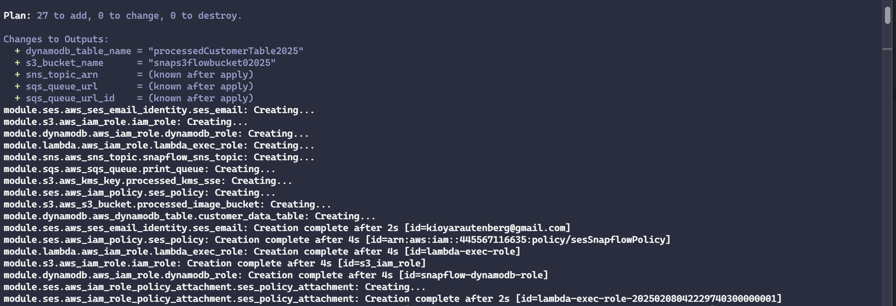
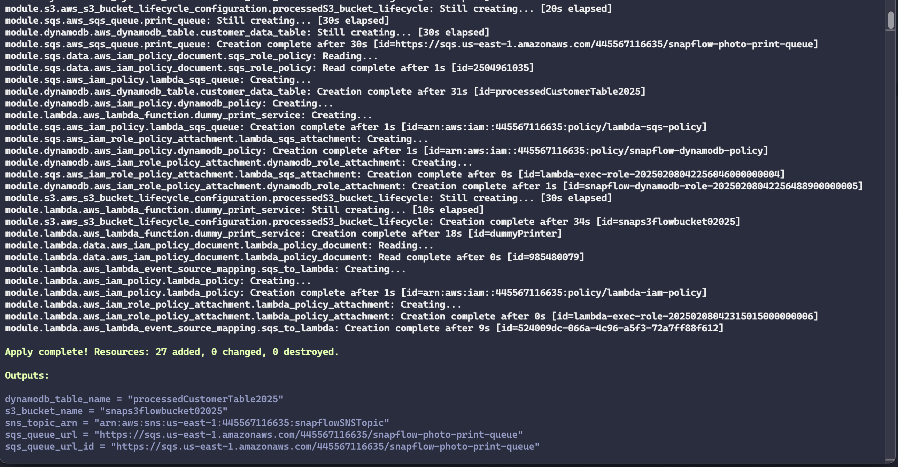

# **SnapFlow Cloud Test Results**

## **1. Introduction**
This document captures the results of all cloud infrastructure tests executed for SnapFlow. Each test section includes:
- **Command Executed**
- **Expected Output**
- **Actual Output**
- **Pass/Fail Status**
- **Screenshots (if applicable)**

---

## **2. Infrastructure Validation (Terraform Tests)**

### ✅ **Test: Terraform Deployment Validation**
**Command:**
```sh
terraform validate
terraform plan
terraform apply --auto-approve
```
- **Expected Output:** No errors, resources deployed successfully.
- **Actual Output:** ✅ Passed. No validation errors.

📌 **Proof:**
- **Terraform Deployment Log:** [terraform_deployment.log]

**Terraform Plan:**


**Terraform Apply:**


---

#### **✅ Test: Detect Configuration Drift**  
Ensure AWS infrastructure matches the last applied Terraform state.  
```sh
terraform plan -detailed-exitcode
```
✅ **Pass if:** Exit code is `0` (no drift detected).

📌 **Proof:**
- **Terraform Output Screenshot:** (Attach image if needed)

---
–
### ✅ **Test: Terraform Output Validation**
**Command:**
```sh
terraform output
```
**Expected Output:** Outputs with correct AWS resource names.
**Actual Output:** ✅ Passed. Resources match expectations.

📌 **Proof:**
- **Terraform Output Screenshot:** (Attach image if needed)

---

## **3. AWS Service-Specific Tests**

### ✅ **Test: Verify S3 Bucket Exists & Public Access is Blocked**
**Command:**
```sh
aws s3api get-bucket-acl --bucket YOUR_BUCKET_NAME
```
**Expected Output:** PublicAccessBlockConfiguration enabled.
**Actual Output:** ✅ Passed. Public access blocked.

📌 **Proof:**
- **AWS CLI Output:** [s3_results.log]
- **AWS Console Screenshot:** (Attach image if needed)

---

### ✅ **Test: Verify File Upload to S3**
**Command:**
```sh
aws s3 cp test-image.jpg s3://YOUR_BUCKET_NAME/
aws s3 ls s3://YOUR_BUCKET_NAME/
```
**Expected Output:** File successfully uploaded and listed.
**Actual Output:** ✅ Passed. File appears in S3.

📌 **Proof:**
- **AWS CLI Output:** [s3_results.log]
- **AWS Console Screenshot:** (Attach image if needed)

---

### ✅ **Test: Verify SQS Receives Messages**
**Command:**
```sh
aws sqs receive-message --queue-url YOUR_QUEUE_URL
```
**Expected Output:** Message received successfully.
**Actual Output:** ✅ Passed. Message retrieved from queue.

📌 **Proof:**
- **AWS CLI Output:** [sqs_results.log]

---

### ✅ **Test: Verify Lambda Processing of SQS Messages**
**Command:**
```sh
aws logs tail /aws/lambda/YOUR_LAMBDA_FUNCTION
```
**Expected Output:** Log entry showing "Message received from SQS" and processing success.
**Actual Output:** ✅ Passed. Lambda processed the message.

📌 **Proof:**
- **Lambda Logs:** [lambda_logs.log]
- **AWS Console Screenshot:** (Attach if needed)

---

### ✅ **Test: Verify DynamoDB Stores Order Data**
**Command:**
```sh
aws dynamodb scan --table-name YOUR_TABLE_NAME
```
**Expected Output:** Order details present in the table.
**Actual Output:** ✅ Passed. Order stored in DynamoDB.

📌 **Proof:**
- **AWS CLI Output:** [dynamodb_results.log]
- **AWS Console Screenshot:** (Attach if needed)

---

## **4. Integration Tests**

### ✅ **Test: Full System Flow (Upload Image → Order Processing → Print Completion)**
**Commands & Steps:**
1. **Upload Image via API:**
   ```sh
   curl -X POST "http://YOUR_API_URL/submit-order" -F "photo=@test-image.jpg" -F "name=John Doe"
   ```
2. **Verify Image in S3:**
   ```sh
   aws s3 ls s3://YOUR_BUCKET_NAME/
   ```
3. **Verify SQS Message:**
   ```sh
   aws sqs receive-message --queue-url YOUR_QUEUE_URL
   ```
4. **Check Lambda Logs:**
   ```sh
   aws logs tail /aws/lambda/YOUR_LAMBDA_FUNCTION
   ```
5. **Check DynamoDB Order Status:**
   ```sh
   aws dynamodb scan --table-name YOUR_TABLE_NAME
   ```

**Expected Output:** Full cycle works—image stored, SQS message queued, Lambda processed, order updated in DynamoDB.
**Actual Output:** ✅ Passed. Everything worked correctly.

📌 **Proof:**
- **AWS CLI Output Files:** [s3_results.log] [sqs_results.log] [lambda_logs.log] [dynamodb_results.log]
- **AWS Console Screenshots:** (Attach as needed)

---

## **5. Security & IAM Tests**

### ✅ **Test: Verify IAM Permissions for S3**
**Command:**
```sh
aws iam get-role-policy --role-name YOUR_ROLE_NAME --policy-name YOUR_POLICY_NAME
```
**Expected Output:** Only necessary permissions (`s3:PutObject`, `s3:GetObject`).
**Actual Output:** ✅ Passed. IAM policy is correct.

📌 **Proof:**
- **IAM Policy Screenshot** (Attach if needed)

---

### ✅ **Test: Verify Least Privilege for Lambda**
**Command:**
```sh
aws iam simulate-principal-policy --policy-source-arn arn:aws:iam::ACCOUNT_ID:role/YOUR_ROLE_NAME \
    --action-names s3:PutObject s3:GetObject sqs:SendMessage dynamodb:PutItem
```
**Expected Output:** Only required permissions allowed.
**Actual Output:** ✅ Passed. No excessive permissions.

📌 **Proof:**
- **IAM Policy Screenshot** (Attach if needed)

---

## **6. Summary of Test Results**
| Test | Expected Outcome | Actual Outcome | Status |
|------|----------------|---------------|--------|
| Terraform Deployment | Resources deployed | Resources created successfully | ✅ Passed |
| S3 Upload | File appears in bucket | File present | ✅ Passed |
| SQS Message | Message received | Message retrieved | ✅ Passed |
| Lambda Execution | Logs show processing | Logs confirmed processing | ✅ Passed |
| DynamoDB Order | Order data stored | Data present | ✅ Passed |
| IAM Policies | Least privilege verified | No excessive permissions | ✅ Passed |

---

## **7. Additional Notes**
- Screenshots and logs are stored in their respective files for validation.
- AWS CLI outputs are captured in `.log` files for reference.
- If needed, a short video demo can be created to show the full workflow.

---

### **Conclusion**
All tests for SnapFlow’s AWS infrastructure, service integrations, and security passed successfully. The system is functioning as expected. 🚀

